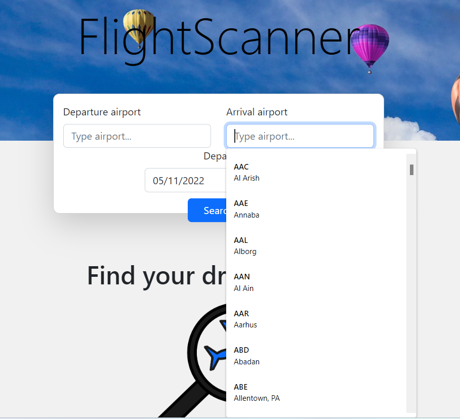
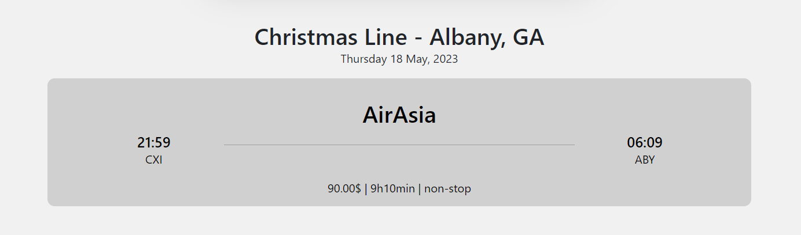
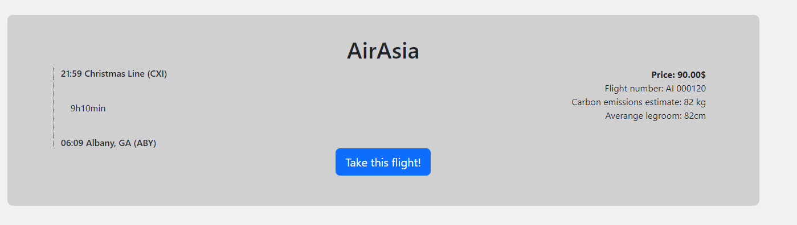
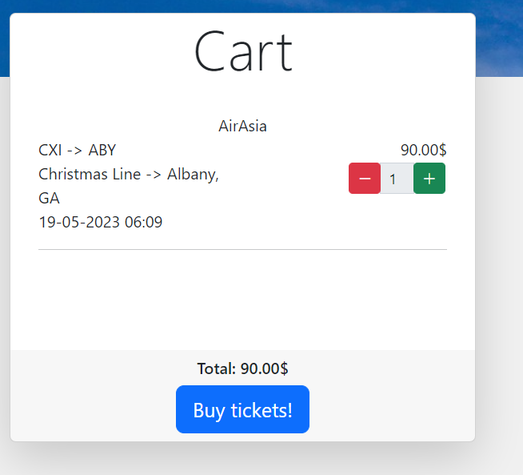
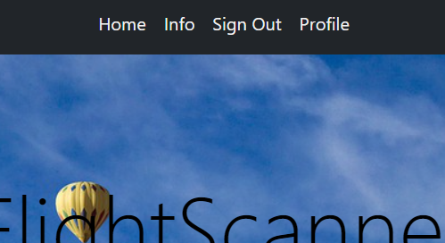
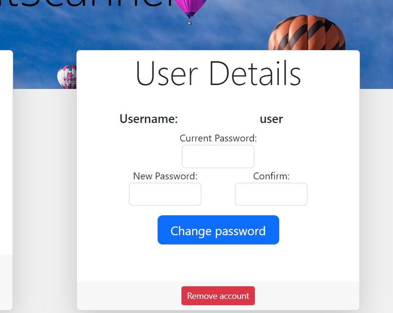

# Flight Search Engine
Spring MVC app with flight search engine.

## Table of Contents
* [General Info](#general-info)
* [Related repositories](#related-repositories)
* [Technologies Used](#technologies-used)
* [Setup](#setup)
* [Overview](#overview)
* [Room for Improvement](#room-for-improvement)

## General Info
I've created this project to learn Spring MVC and Thymeleaf. Unfortunately no company provides for free
REST API with flight data, so I had to create [flight generator](https://github.com/bladeours/random-flights-generator) then built
[REST API](https://github.com/bladeours/flight-api) to get mocked flight data. You can create account,
change password, remove account or add flight to cart. Frontend is responsive, so you can check this project 
on your phone.

## Related repositories
* [Flight API](https://github.com/bladeours/flight-api)
* [Airport API](https://github.com/bladeours/airport-api)
* [Random flights generator](https://github.com/bladeours/random-flights-generator)

## Technologies Used
* Java 17
* Spring 2.7.3
  * Spring Boot 
  * Spring Security
  * Spring Web
* Thymeleaf
* Bootstrap
* Junit 5
* Hibernate
* PostgreSQL

## Setup
### Run with Docker
* `git clone https://github.com/bladeours/flight-search-engine.git`
* `docker-compose up -d`

App runs on 8084 port, but you can change it in `.env` file. \
Docker compose runs:
* **flight-web-db** - PostgreSQL database for flight search engine app
* **flight-web-app** - This app
* **flight-api-db** - MySQL database for [API with flights](https://github.com/bladeours/flight-api)
* **flight-api-app** - [API with flights](https://github.com/bladeours/flight-api)
* **flight-generator** - [flight generator](https://github.com/bladeours/random-flights-generator)
* **airport-api-db** - MongoDB database for [API with airports](https://github.com/bladeours/airport-api)
* **airport-api-db-seed** - Container for importing data to airport-api-db
* **airport-api-app** - [API with airports](https://github.com/bladeours/airport-api)

### Install on local machine
#### Install PostgreSQL
* Check official [PostgreSQL documentation](https://www.postgresql.org/download/)

#### Import data
* `psql -U username -d flightSearchEngineDB -a -f database/flight_search_engine/create_database.sql`

#### Run app
This app requires Java 17
* `java -jar flightSearchEngine.jar`

* app runs on port 8084 

## Overview

### Add flight to Cart
* Simply find your airports from list

* chose your flight

* click Take this flight!

* now you can see flight in your cart

### change password
* click profile on navigation bar

* then easily change password

## Room for Improvement
- [ ] Add sending mail
- [ ] Add return flight
- [ ] Add luggage
- [ ] Reduce amount of airports

